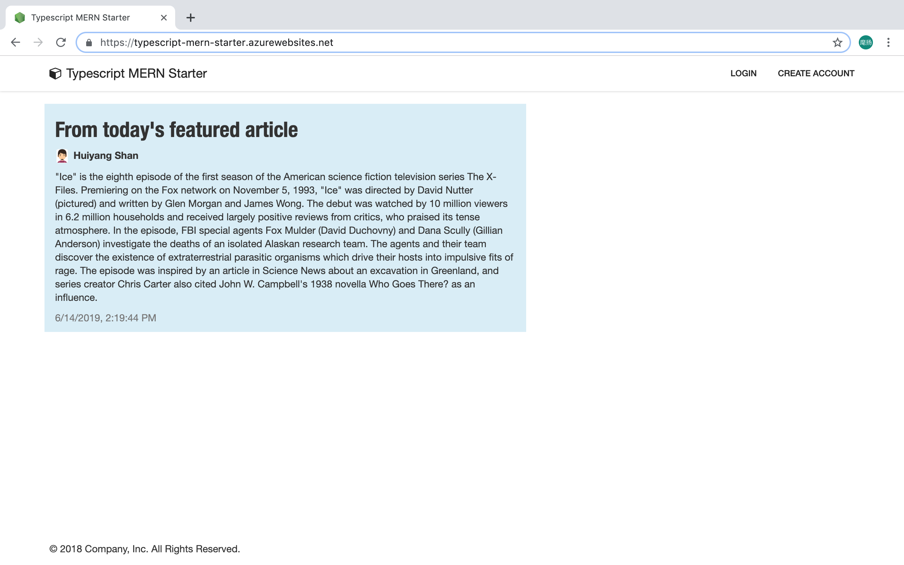

# TypeScript MERN Starter
> **Note!** This project is still **under construction**, but it has already been working well. You can go to the [Quick Start](#quick-start) part, then have a try.

**Live Demo:** [https://typescript-mern-starter.azurewebsites.net/](https://typescript-mern-starter.azurewebsites.net/)



This project is intended to build a RESTful MERN start point in TypeScript. With this project as a start point you can easily extend it to a community or blog app.

MERN is a free and open-source JavaScript software stack for building dynamic web sites and web applications. The MERN stack is composed of MongoDB, Express.js, React, and Node.js. 

This project implemented MERN in **TypeScript**. TypeScript is a typed superset of JavaScript. It has become popular recently in applications due to the benefits it can bring. 
If you are new to TypeScript it is highly recommended to become familiar with it first before proceeding. You can check out its documentation [here](https://www.typescriptlang.org/docs/handbook/typescript-in-5-minutes.html).

TypeScript has brought the following benefits to MERN:

- **Unified modeling** across web client and server for objects
- Type safety, and easy refactoring of typed code across web client and server
- A superior developer experience in a team environment

Not only using TypeScript, but this project is also featured by:

- **[RESTful-style](https://www.restapitutorial.com/lessons/whatisrest.html)**, powered by an embedded [oauth2 server](https://github.com/jaredhanson/oauth2orize) and [passport.js](http://www.passportjs.org/), this project separate client and server clearly.
- **[React-router 4.0](https://reacttraining.com/react-router/)**, with it you can easily define client routes and manage them.
- **[Redux](https://redux.js.org/introduction)**, with it you can easily manage client states.
- **Almost ready** for a community app. We modelled ```User``` as well as ```Article```. This is a **real starter**  for who would like to build an community app on MERN.
- The client code is created from [create-react-app](https://facebook.github.io/create-react-app/), so now you can get rid of annoying configurations for babel and webpack.
# Quick start
## Prerequisite
To build and run this app locally you will need a few things:
- Install [Node.js](https://nodejs.org/en/)
- Install [MongoDB](https://docs.mongodb.com/manual/installation/)
- Install [VS Code](https://code.visualstudio.com/)
- Install [Yarn](https://yarnpkg.com/)

## Clone the repository
```
git clone https://github.com/shanhuiyang/TypeScript-MERN-Starter.git <project_name>
```
## Install dependencies
```
cd <project_name>
yarn install
```
## Start your mongoDB server
(you'll probably have to start another command prompt)
```
mongod
```
## Build and run the project
```
yarn start
```
Finally, navigate to [http://localhost:3000](http://localhost:3000) and you should see the template being served and rendered locally!
# Motivation
(constructing...)
# Project structure
(constructing...)
# How to debug
(constructing...)
# Tests
(constructing...)
# Tutorial 
(constructing...)
# Deploying the app
There are many ways to deploy an Node app, and in general, nothing about the deployment process changes because you're using TypeScript.
In this section, let's show you how to deploy this project to Azure App Service.
## Prerequisite
- [**Azure account**](https://azure.microsoft.com/en-us/free/) - If you don't have one, you can sign up for free.
The Azure free tier gives you plenty of resources to play around with including up to 10 App Service instances, which is what we will be using.
- [**VS Code**](https://code.visualstudio.com/) - We'll be using the interface provided by VS Code to quickly deploy our app.
- [**Docker Desktop**](https://www.docker.com/products/docker-desktop) - Usually you need to sign in or sign up on [Docker hub](https://hub.docker.com/) first.
## Create production MongoDB
In this step, you create a MongoDB database in Azure. When your app is deployed to Azure, it uses this cloud database.
For MongoDB, we use Azure Cosmos DB. Cosmos DB supports MongoDB client connections.
### Open Azure Cloud Shell
1. Sign in [Azure Portal](https://portal.azure.com) using your account.
2. Open [Azure cloud shell button](https://docs.microsoft.com/en-us/azure/app-service/app-service-web-tutorial-nodejs-mongodb-app#open-azure-cloud-shell) on the menu in the upper-right corner of the portal.
3. Then if you are prompted that **You have no storage mounted**, just click **Create Storage**.
### Create a resource group
In the opened shell enter following command. Change the location according to your preference.
```
az group create --name myResourceGroup --location "West Europe"
```
After entering this you should get a Json response in the shell. With following property in it.
```
"properties": {
    "provisioningState": "Succeeded"
}
```
### Create a Cosmos DB account
In the following command, substitute a unique Cosmos DB name for the ```<cosmosdb_name>``` placeholder. This name is used as the part of the Cosmos DB endpoint, ```https://<cosmosdb_name>.documents.azure.com/```, so the name needs to be unique across all Cosmos DB accounts in Azure. The name must contain only lowercase letters, numbers, and the hyphen (-) character, and must be between 3 and 50 characters long.
```
az cosmosdb create --name <cosmosdb_name> --resource-group myResourceGroup --kind MongoDB
```
When the Cosmos DB account is created several minutes later, the Azure CLI shows information similar to the following example:
```
{
  "consistencyPolicy":
  {
    "defaultConsistencyLevel": "Session",
    "maxIntervalInSeconds": 5,
    "maxStalenessPrefix": 100
  },
  "databaseAccountOfferType": "Standard",
  "documentEndpoint": "https://<cosmosdb_name>.documents.azure.com:443/",
  "failoverPolicies": 
  ...
  < Output truncated for readability >
}
```
## Connect app to production MongoDB
In this step, you connect Typescript MERN project to the Cosmos DB database you just created, using a MongoDB connection string.
### Retrieve the database key
To connect to the Cosmos DB database, you need the database key. In the Cloud Shell, use following command to retrieve the primary key.
```
az cosmosdb list-keys --name <cosmosdb_name> --resource-group myResourceGroup
```
The Azure CLI shows information similar to the following example:
```
{
  "primaryMasterKey": "RS4CmUwzGRASJPMoc0kiEvdnKmxyRILC9BWisAYh3Hq4zBYKr0XQiSE4pqx3UchBeO4QRCzUt1i7w0rOkitoJw==",
  "primaryReadonlyMasterKey": "HvitsjIYz8TwRmIuPEUAALRwqgKOzJUjW22wPL2U8zoMVhGvregBkBk9LdMTxqBgDETSq7obbwZtdeFY7hElTg==",
  "secondaryMasterKey": "Lu9aeZTiXU4PjuuyGBbvS1N9IRG3oegIrIh95U6VOstf9bJiiIpw3IfwSUgQWSEYM3VeEyrhHJ4rn3Ci0vuFqA==",
  "secondaryReadonlyMasterKey": "LpsCicpVZqHRy7qbMgrzbRKjbYCwCKPQRl0QpgReAOxMcggTvxJFA94fTi0oQ7xtxpftTJcXkjTirQ0pT7QFrQ=="
}
```
Copy the value of ```primaryMasterKey```. You need this information in the next step.
### Configure the connection string in your Node.js application
In your Typescript MERN project open file _.env.production_. Replace the two ```<cosmosdb_name>``` placeholders with your Cosmos DB database name, and replace the ```<primary_master_key>``` placeholder with the key you copied in the previous step.
```
MONGODB_URI=mongodb://<cosmosdb_name>:<primary_master_key>@<cosmosdb_name>.documents.azure.com:10250/typescript-mern-starter?ssl=true&sslverifycertificate=false
```
The ```ssl=true``` option is required because Cosmos DB requires SSL. Save your changes.
### Test the application in production mode
In file _.env.production_, change the ORIGIN_URI to the localhost. Meanwhile change the ports number from 80 to 3000 because your local 80 port may have been blocked.
```
PORT=3000
SERVER_PORT=3000
ORIGIN_URI=http://localhost
```
Open your local terminal. Switch the local node env from development to production by entering following commands.
```
# Bash
NODE_ENV=production
# Windows PowerShell
$env:NODE_ENV = "production" 
```
Build the production for your TypeScript MERN project.
```
yarn build
```
Start your local production server.
```
yarn serve
```
In the output of terminal, you should see that **MongoDB is connected successfully**.

Navigate to http://localhost:3000 in a browser. Click Sign Up in the top menu and create a test user. If you are successful creating a user and signing in, then your app is writing data to the Cosmos DB database in Azure. You can check that in your Azure portal's **Azure Cosmos DB account** page using **Data Explorer**.

In the terminal, stop Node.js by typing Ctrl+C.
## Build app into a Docker image
Firstly, we will [deploy the production app to Docker image](https://docs.docker.com/get-started/part2/) because of its great flexibility. Nowadays almost every cloud service support deploying web app using Docker image. Therefore once we have a well constructed Docker image then we can easily deploy our app to **any platform** with little adaption. In next section we will deploy the Docker image generated in this section to [Azure app service](https://docs.microsoft.com/en-us/azure/app-service/containers/quickstart-docker-go). Let's generate the Docker image locally in this section.
### Configure environment variables for production
In file _.env.production_, change the ORIGIN_URI to the target app url. Meanwhile change the ports number from 3000 back to 80.
```
PORT=80
SERVER_PORT=80
ORIGIN_URI=https://<your_app_name>.azurewebsites.net
```
### Build app into a local Docker image
We are ready to build the app. Make sure you are still at the root directory in your repository, which includes a ```Dockerfile```

Now run the build command. This creates a Docker image, which we’re going to name using the --tag option. Use -t if you want to use the shorter option. Replace <your_app_name> with your desired app name. This command will take your several minutes to finish for the first time you run it.
```
docker build --tag=<your_app_name> .
```
Where is your built image? It’s in your machine’s local Docker image registry:
```
$ docker image ls

REPOSITORY            TAG               IMAGE ID
<your_app_name>       latest            326387cea398
```
### Push Docker image to Docker hub
If you don’t have a Docker account, sign up for one at [hub.docker.com](hub.docker.com). Make note of <your_username>.

Log in to the Docker public registry on your local machine.
```
docker login
```
We need to tag the image with a meaningful version label using following command, e.g. azure. Replace <your_app_name> and <your_username>, and run the command.
```
docker tag <your_app_name> <your_username>/<your_app_name>:azure
```
Finally, upload your tagged image to the repository:
```
docker push <your_username>/<your_app_name>:azure
```
Once complete, the results of this upload are publicly available. If you log in to Docker Hub, you see the new image there, with its pull command.
## Create an Azure app service using Docker image
Traditionally, we can deploy a node.js app using git repository on Azure app service. That is to say, you can push your git repository to the Azure app service, then it will start your app by running ```npm run start```. In practice this is not a easy-to-use approach since you have very limited ability to control the installation and build process for your app on Azure app service.

Using Docker image you can get rid of many annoying environment issues, and will easily migrate your app to other cloud platforms in future.
### Create an Azure app service in Azure portal
Open Azure portal, click the quick link of *App Services*. Then click the +Add button. You will probably see the portal looks like following:


Fill the create wizard like this.
- Resource Group: click *Create new*, and name it like ```myLinuxGroup```
- Name: use <your_app_name>
- Publish: click *Docker Image*
- Operating System: Linux
- Region: choose one near your place
- Sku and size: Free F1 is OK, you can scale it up later on your demand
Then click *Next: Docker >*, you will probably see the portal looks like following:


Fill this wizard like following.
- Options: keep it as *Single Container*
- Image Source: *Docker Hub*
- Access Type: keep it *public*
- Image and tag: <your_username>/<your_app_name>:azure, the one you just published in previous section

Finally you are ready to create your app service with Docker image. Click ***Review and Create***. Then click ***Create*** after the portal navigate you to the next page.

### Verify your Azure app service
After click *create* for the Azure app service, you will get the finish notification.


> **Note!** Indeed it is still preparing the resources internally. If you see 5xx error on your site at [https://<your_app_name>.azurewebsites.net](https://<your_app_name>.azurewebsites.net), don't feel frustrated. You have to wait up to 20 minutes to verify your new app successfully. 

After the app is ready, please note that the browser has marked your site trustful, i.e. Azure has served SSL for your site.

**Congratulation!** You have deployed a real working web app!
## Map custom domain and bind SSL certificate
Usually the web address https://<your_app_name>.azurewebsites.net cannot fulfil your requirement for a real product, since you would like to give your customer a more concise and noticeable url. You can follow the steps below to adapt the app you just deployed on Azure to a desired domain name.
1. Register a domain you like.
2. Modify your _.env.production_, so that ```ORIGIN_URI=https://<domain_you registered>```
3. Re-deploy your app to https://<your_app_name>.azurewebsites.net by following steps introduced in previous sections.
4. Follow the tutorial of [map custom domain](https://docs.microsoft.com/en-us/azure/app-service/app-service-web-tutorial-custom-domain).
5. Follow the tutorial of [bind SSL certificate](https://docs.microsoft.com/en-us/azure/app-service/app-service-web-tutorial-custom-ssl). Please note that bind a valid SSL certificate is must-do for Typescript-MERN-starter projects.
## Summary
From this part we can see that deploy a Typescript-MERN-starter project to Azure is very easy. What you have to be worry about is just to configure the environment variables correctly. 

Further more, you can do following to improve your engineering experience if you are using Azure as your could platform.
1. You can [configure the CI/CD procedure](https://docs.microsoft.com/en-us/azure/app-service/containers/app-service-linux-ci-cd) on Azure app service so that you can save a lot of mouse click in future.
2. You can write your own [```docker-compose.yml```](https://docs.docker.com/get-started/part3/) to manage/orchestrate multiple services including your app service. For example you can add the [mongodb](https://hub.docker.com/_/mongo) service so that you can avoid using the Azure Cosmos DB. Then when you deploy your docker image, choose *Docker Compose (Preview)* instead of *Single Container* for *Options*.

If you don't like Azure, e.g. you prefer AWS, you can easily [deploy your Docker image](https://aws.amazon.com/getting-started/tutorials/deploy-docker-containers/) to AWS too. The flexibility of Docker make the migration from one platform to another very simple.
# CI and Collaboration
(constructing...)
# Prior Art
### TypeScript-Node-Starter
https://github.com/Microsoft/TypeScript-Node-Starter
### mern-starter
https://github.com/Hashnode/mern-starter
### oauth2api
https://github.com/PatrickHeneise/oauth2api
# Road Map
We would like to extend this project from MERN to MERRN, where the additional R stands for ReactNative. TypeScript will show the power of modeling in a **real fullstack** web app.