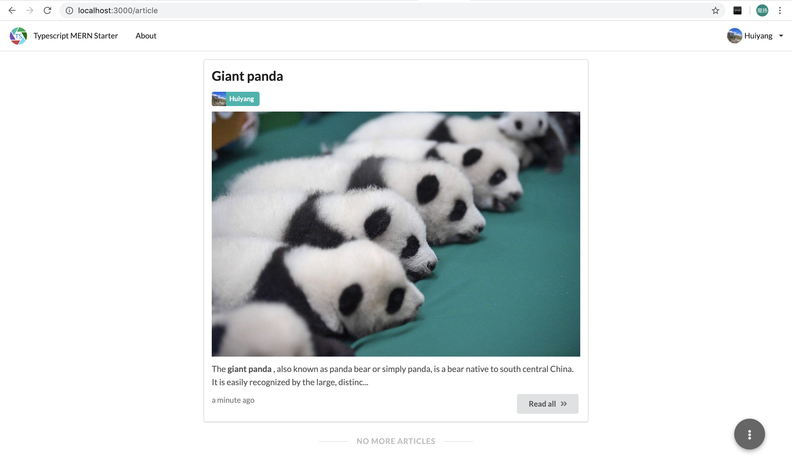
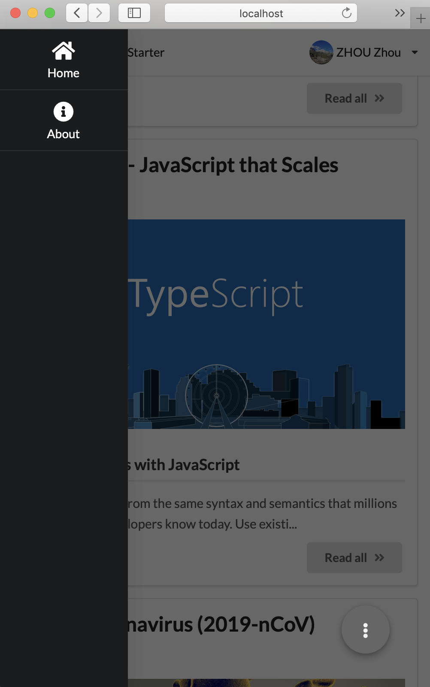
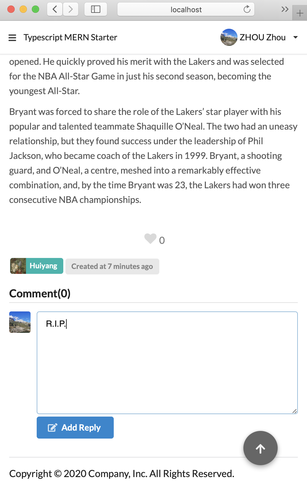
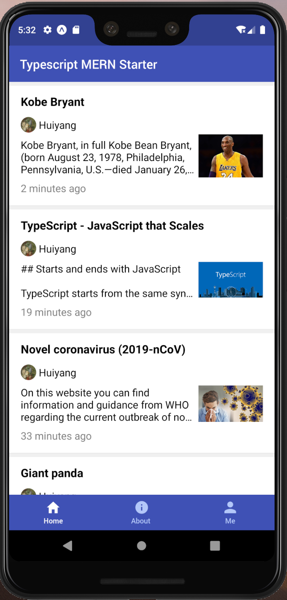
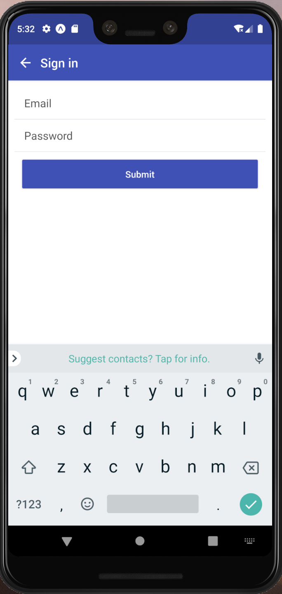
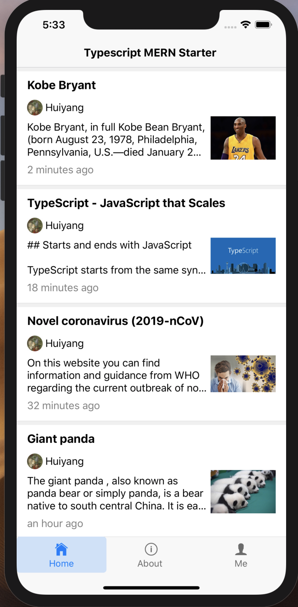
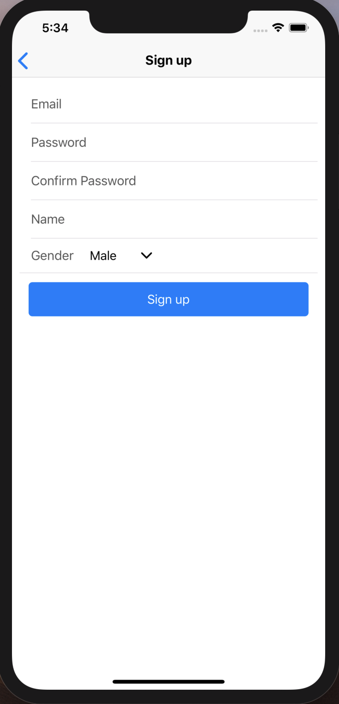

# TypeScript MERN Starter

[](https://travis-ci.org/shanhuiyang/TypeScript-MERN-Starter)
[](https://david-dm.org/shanhuiyang/TypeScript-MERN-Starter)
[](https://img.shields.io/badge/PRs-welcome-brightgreen.svg)

**Live Demo:** [https://hd283.net/](https://hd283.net/)

| Supported Clients        | Preview                 |
| ------------------------ | ----------------------- |
| Web                      |   |
| Web (Mobile)             |  |
| Android                  |    |
| iOS                      |    |

**This project built a real blog app for all platforms in TypeScript.**

TypeScript is a typed super set of JavaScript.
If you are new to TypeScript it is highly recommended to become familiar with it first before proceeding.
You can check out its documentation [here](https://www.typescriptlang.org/docs/handbook/typescript-in-5-minutes.html).

**MERN** stands for **M**ongoDB, **E**xpress.js, **R**eact/**R**eactNative, and **N**ode.js.

TypeScript has brought the following benefits to MERN:

- **Unified modeling** across web client and server for objects
- Type safety, and easy refactoring of typed code across web client and server
- A superior developer experience in a team environment

Not only using TypeScript, but this project is also featured by:

- **Real fullstack**, because you can build node **server**, Mongo DB, multimedia storage, **website** (for both desktop and mobile), **Android** app, and **iOS** app based on this project **in single programming language**.
- **[RESTful-style](https://www.restapitutorial.com/lessons/whatisrest.html)**. Powered by an embedded [oauth2 server](https://github.com/jaredhanson/oauth2orize) and [passport.js](http://www.passportjs.org/), this project separate client and server clearly. Then the REST server can serve for both website and mobile clients simultaneously.
- **[React-router 4.0+](https://reacttraining.com/react-router/)**, with it you can easily define client routes and manage them.
- **[Redux](https://redux.js.org/introduction)**, with it you can easily manage client states. Also **all clients shared the same state machine** implemented by Redux, we reduced a lot of effort when you develop for multi-clients.
- **Almost ready** for a blog app. We modeled `User` as well as `Article`. This is a **real starter** for who would like to build a blog app or extend it to a community app using MERN.
- The web client code is created from **[create-react-app](https://facebook.github.io/create-react-app/)**, so now you can get rid of annoying configurations for babel and webpack.
- The Android/iOS client is created from **[Expo](https://expo.io)**, which is a tool encapsulated a lot of complexity when you develop on ReactNative.

## Table of Content

- [Quick start](#quick-start)
  - [Before Start](#before-start)
  - [Clone the repository](#clone-the-repository)
  - [Install dependencies](#install-dependencies)
  - [Start your mongoDB server](#start-your-mongodb-server)
  - [Build and run the project](#build-and-run-the-project)
  - [Start the mobile apps](#start-the-mobile-apps)
- [Motivation](#motivation)
  - [Prior Art](#prior-art)
  - [Philosophy](#philosophy)
  - [Work Items](#work-items)
- [Project structure](#project-structure)
  - [Dependencies](#dependencies)
  - [Folder structure](#folder-structure)
  - [Create React App](#create-react-app)
    - [Serve static assets of client and index.html in production](#serve-static-assets-of-client-and-indexhtml-in-production)
    - [Proxy API requests in development](#proxy-api-requests-in-development)
  - [Unified Modeling](#unified-modeling)
  - [Embedded OAuth2 server](#embedded-oauth2-server)
    - [OAuth 2.0 protocol](#oauth-20-protocol)
    - [Resource server](#resource-server)
    - [Authorization server](#authorization-server)
    - [Summary of OAuth2 server](#summary-of-oauth2-server)
  - [Server routing & client routing](#server-routing-&-client-routing)
    - [React-router 4.0+](#react-router-40+)
    - [Performance perspective](#performance-perspective)
  - [Styling](#styling)
- [How to debug](#how-to-debug)
  - [Available scripts](#available-scripts)
  - [Debugging website client](#debugging-website-client)
  - [Debugging mobile client](#debugging-mobile-client)
  - [Debugging server](#debugging-server)
  - [Debugging tests](#debugging-tests)
- [Tests](#tests)
- [Deploying the app](#deploying-the-app)
  - [Prerequisite](#prerequisite)
  - [Create production MongoDB (Option 1: Azure CosmosDB)](#create-production-mongodb--option-1--azure-cosmosdb-)
    - [Open Azure Cloud Shell](#open-azure-cloud-shell)
    - [Create a resource group](#create-a-resource-group)
    - [Create a Cosmos DB account](#create-a-cosmos-db-account)
    - [Retrieve the database key](#retrieve-the-database-key)
    - [Configure the connection string in your Node.js application](#configure-the-connection-string-in-your-nodejs-application)
  - [Create production MongoDB (Option 2: MongoDB Atlas)](#create-production-mongodb--option-2--mongodb-atlas-)
  - [Create a production blob storage](#create-a-production-blob-storage)
  - [Test the application in production mode](#test-the-application-in-production-mode)
  - [Build app into a Docker image](#build-app-into-a-docker-image)
    - [Configure environment variables for production](#configure-environment-variables-for-production)
    - [Build app into a local Docker image](#build-app-into-a-local-docker-image)
    - [Push Docker image to Docker hub](#push-docker-image-to-docker-hub)
  - [Create an Azure app service using Docker image](#create-an-azure-app-service-using-docker-image)
    - [Add an Azure app service in Azure portal](#add-an-azure-app-service-in-azure-portal)
    - [Verify your Azure app service](#verify-your-azure-app-service)
  - [Map custom domain and bind SSL certificate](#map-custom-domain-and-bind-ssl-certificate)
  - [Deploy the mobile apps](#deploy-the-mobile-apps)
  - [Summary of deployment](#summary-of-deployment)

## Quick start

### Before Start

To build and run this app locally you will need a few things:

- Install [Chrome](https://www.google.com/chrome/)
- Install [Node.js](https://nodejs.org/en/)
- Install [MongoDB](https://docs.mongodb.com/manual/installation/)
- Install [VS Code](https://code.visualstudio.com/)
- Install [Yarn](https://yarnpkg.com/)
- Install [Expo Cli](https://expo.io/tools#cli)

### Clone the repository

```bash
git clone https://github.com/shanhuiyang/TypeScript-MERN-Starter.git <project_name>
```

### Install dependencies

```bash
cd <project_name>
yarn
```

### Start your mongoDB server

(you'll probably have to start another command prompt)

```bash
mongod
```

> **Note!** While you just installed MongoDB (for both on OSX or Windows),
> it may remind you that you can run MongoDB **as service**,
> then your MongoDB will always be running even after you restart your computer.

### Build and run the project

```bash
yarn start
```

Finally, navigate to [http://localhost:3000](http://localhost:3000) and you should see the blog page being served and rendered locally!

> **Note!** You **cannot** open the localhost website on IE and Edge browser.
> In contrast, you can open it on Safari, Firefox, and Chrome.
> However, we will ensure the compatibility of the production app on IE and Edge browser.

### Start the mobile apps

The command `yarn start` will also start the react-native project using expo-cli.
So you can navigate to [http://localhost:19002](http://localhost:19002) and you will see the Expo DevTool page.
From that page you can easily start your app for both Android and iOS by clicking corresponding buttons.

For more detail of prerequisite please refer to [Installation](https://docs.expo.io/versions/v34.0.0/introduction/installation/) of Expo document.

Briefly speaking, you should prepare for devices you would like to debug on, either emulator/simulator or physical devices.

[TODO] Elaborate this part.

> **Note!** Currently you cannot test Android app on emulator without configure the host url manually.
> This is because in Android emulator you cannot access `http://localhost` which hosted on the same server/PC/Mac.
> You can test your app in the same LAN, see next section for detail.

### Optional: Test your app on other device in the same LAN

By default the request url connect client and service are `http://localhost`, i.e. you can only test client and service in the same server/PC/Mac.

To test your app in LAN, you can do following before enter command `yarn start`.

1. Get the IP address (either global IP or LAN IP) of your development server. 
2. Modify the constant `HOST_NAME_DEV` in [client/core/src/models/HostUrl.ts](client/core/src/models/HostUrl.ts) with the IP address you got.

### Optional: Test with OTP sending

This project implement the auth service, as well as account verification by sending OTP to user's registered email account.

By default the account verification is turned off since SMTP transporter is not configured with account and password.

To test this part of functionality, you can:

1. add your email account and password to [server/config/smtp-transporter.ts](server/config/smtp-transporter.ts).
2. change the flag to `true` in [client/core/src/shared/constants.ts](client/core/src/shared/constants.ts).

## Motivation

Up to 2020, React is the most popular front-end framework.
For novice web developers, if they would like to build a full-stack project using Javascript, they can intuitively choose the combination of Node.js and React.

Typescript is a success Javascript alternative which can keep the maintainability as the project grows.
The most famous Typescript project is [Angular](https://angular.io).
Nowadays React also [support Typescript officially](https://facebook.github.io/create-react-app/docs/adding-typescript).

Therefore, the motivation of this project is building a fullstack web app using Typescript, then we can maintain and extend a web app easily.

On the other hand, we have seen the template like TypeScript-Node-Starter, TypeScript-React-Starter, and TypeScript-React-Native-Starter.
What if we mixed these 3 projects together?
How could Typescript shows its advantage if we use it across client & server?
So this project is intended to explore the capability of Typescript in that circumstance.

### Prior Art

[mern-starter](https://github.com/Hashnode/mern-starter) is a famous project which combine React and Node.js in a single project.
However, it is deprecated after April, 2019.
This project is a server rendering solution.
It modeled the `Post` object, but did not implement the authentication module.

[TypeScript-Node-Starter](https://github.com/Microsoft/TypeScript-Node-Starter) is an officially built starter project for Node.js by Microsoft.
This project is a good starter for Node.js app using Typescript.
It is also a server rendering solution, using [pug](https://github.com/pugjs/pug).

Indeed **TypeScript-MERN-Starter** is built on top of TypeScript-Node-Starter.
However, as you can see in **TypeScript-MERN-Starter**, the architecture has been totally changed comparing to TypeScript-Node-Starter.

[oauth2api](https://github.com/PatrickHeneise/oauth2api) is a good example on how to implement OAuth2 strategy in an Node.js app.
We almost totally imported this project to **TypeScript-MERN-Starter**.

### Philosophy

We build this project on following philosophies:

1. **Beginner friendly**. You can start the app without any complex configuration for build and runtime.
2. **Easy to extend**. You can always focus on your business logic. We chose well-documented 3rd party packages to use, so that you can extend this app easily by following the working patterns of these packages.
3. **Share the code as much as possible**. For example, usually we prefer the 3rd party package who can be used both in React and ReactNative, such as ReactRouter, ReactIntl, etc. In contrast, we gave up to use ReactNavigation, expo-localization which can only used in ReactNative.

### Work items

We have already extended this project from MERN to MER**R**N, where the additional R stands for [ReactNative](https://facebook.github.io/react-native/).

In next period of time (Before end of Feb 2020), we will work on:

- Better documents.
- Use types as many as possible.
- ~~Use Promises instead of callbacks.~~
- ~~Globalization. The text strings should be well managed and easily be extended for multi-languages.~~
- ~~Better error alert.~~
- Tests. The core of client (such as actions, reducers), and server (such as routes, controllers) should be well covered by unit tests.
- Better article UX.
  - ~~Using the list-detail structure.~~
  - ~~User can add comments to articles. (website only)~~
  - ~~Pagination. (website only)~~
- ~~Rich text editors. Using markdown as the exchanging text format.~~
  - ~~Unsaved alert if users are going to close the page.~~
- ~~Notification (website only)~~
  - ~~Comment received for article authors.~~
- ~~Improving the authentication. (website only)~~
  - ~~Email verification for signing up.~~
  - ~~Password modification.~~
  - ~~Forget password.~~
- ~~User-friend time display.~~
- Incoming issues.

## Project structure

In this part, we will not only summarize the folder structure, but also introduce how each of the project gradients works.

Briefly speak, we nested 3 projects in the repo, to get the biggest reusability of code.


Therefore, we fused server, website (for both desktop and mobile), and Android & iOS projects together in this repo.

The basic working flow of the app could be illustrated in the following diagram.


Please note that we did not invent any framework, what we did is taking the advantages of many popular frameworks from React ecosystem, and organize it logically.

### Dependencies


Here is a index for **documents** what the project depends on:

- [Create React App](https://create-react-app.dev/docs/getting-started)
- [Expo](https://docs.expo.io/versions/latest/)
- [Express](https://expressjs.com/en/guide/routing.html)
- [Jest](https://jestjs.io/docs/en/getting-started)
- [MongoDB](https://docs.mongodb.com/manual/)
- [Mongoose](https://mongoosejs.com/docs/guide.html)
- [NativeBase](https://docs.nativebase.io/)
- [Node](https://nodejs.org/en/docs/)
- [PassportJS](http://www.passportjs.org/docs/)
- [React](https://facebook.github.io/react/docs/getting-started.html)
- [ReactNative](https://facebook.github.io/react-native/docs/getting-started)
- [ReactRouter](https://reacttraining.com/react-router/web/guides/quick-start)
- [Redux](https://redux.js.org/introduction/getting-started)
- [Semantic-UI React](https://react.semantic-ui.com/)
- [Typescript](https://www.typescriptlang.org/docs/home.html)

### Folder structure

```
.                                // a complete nodeJS/Express project
├── .vscode                      // VS Code specific settings
|
├── client                       // a complete Expo/ReactNative project: all of the client code
|   |
|   ├── core                     // a complete create-react-app project: all of the website code
|   |   ├── build                // output from your TypeScript build for website
|   |   ├── node_modules         // all of your npm dependencies for website code
|   |   ├── public               // static assets that will be used to build website
|   |   ├── src                  // non-view layer code for both clients, and view layer code of the website
|   |   |   ├── actions          // Redux actions implementations, shared for both website and mobile apps
|   |   |   ├── models           // type definitions, may be used for both server and clients
|   |   |   ├── reducers         // Redux reducers implementations, shared for both website and mobile apps
|   |   |   ├── shared           // common utilities for client, shared for both website and mobile apps
|   |   |   ├── website          // all view layer code of the website
|   |   |   ├── index.tsx        // entry point of the website
|   |   |   ├── serviceWorker.ts // create-react-app generated file, which is used for debug
|   |   |   └── setupProxy.js    // bypasses all REST API calls to nodejs server while debugging
|   |   ├── package.json         // contains npm dependencies and build scripts for website
|   |   └── tsconfig.json        // config settings for compiling website
|   |
|   ├── assets                   // images used by expo/react-native project
|   ├── src                      // all view layer code of the mobile apps
|   ├── app.json                 // Expo configuration for mobile apps
|   ├── App.tsx                  // entry point of the Expo/ReactNative project
|   ├── package.json             // contains npm dependencies and build scripts for mobile apps
|   └── tsconfig.json            // config settings for compiling mobile apps
|
├── dist                         // output from your TypeScript build for node server
├── images                       // README.md referenced images
├── node_modules                 // npm dependencies for server side
├── server                       // all of the source code for server
|   ├── config                   // authorizations and emailer configurations
|   ├── controllers              // controllers respond to various http requests
|   ├── models                   // server specific type definitions, and DB schemas
|   ├── repository               // cloud or local file storage interfaces
|   ├── routes                   // server routing configurations
|   ├── translations             // international strings used by server only
|   ├── util                     // utility functions
|   ├── app.ts                   // server initialization code
|   └── server.ts                // entry point of server
├── .dockerignore                // defines which files or folders cannot be included for docker build
├── .env.development             // defines environment variables while NODE_ENV is development
├── .env.production              // defines environment variables while NODE_ENV is production
├── .travis.yml                  // to configure Travis CI build
├── package.json                 // npm dependencies and build scripts for the whole project
├── start-client.js              // script used to invoke build/start scripts in website project
├── start-mobile.js              // script used to invoke build/start scripts in mobile apps project
├── tsconfig.json                // config settings for compiling server code written in TypeScript
├── tslint.json                  // config settings for TSLint code style checking for server
└── yarn.lock                    // in which Yarnpkg stores versions of each dependency
```

### Create React App

The _client/core_ folder includes a complete React app which was initialized by [Create React App](https://facebook.github.io/create-react-app/).
Create React App is a great tool for beginner since it is:

1. **Less to Learn**. You don't need to learn and configure many build tools. Instant reloads help you focus on development. When it's time to deploy, your bundles are optimized automatically.
2. **Only One Dependency**. Your app only needs one build dependency. Under the hood, it uses Webpack, Babel, ESLint, and **tsc (Typescript compiler)** to power on your app. Then you can get rid of the complicated configurations for them.

#### Serve static assets of client and index.html in production

In production build environment, `react-scripts`, the tool for use with `Create React App` will compile all of your (Typescript) source code and resources into bundles and assets in [client/core/build](client/core/build) folder.

For all routes except those for REST APIs, the Node.js server can response [client/core/build/static/index.html](client/core/build/static/index.html).

That is to say, our server routes all REST APIs, and leave all other possible routes to client.
Server will never make up the client app, it will not decide how would the client should look like.
This is **the first key point to make the RESTful architecture possible**.

#### Proxy API requests in development

However, in development environment, things become totally different.
When you run the command `yarn start` in _client/core_ folder, `react-scripts` will boot a local debug server for you.
This server is implemented in [client/core/src/serviceWorker.ts](client/core/src/serviceWorker.ts).
It makes the hot-reload and other functions for a better development experience.

Then you have 2 servers when you are developing and debugging.
One is the Node.js server developed by yourself, another is the serviceWorker booted by Create React App.
The former serves REST APIs for you, the later serves React app for you.

How could we make these 2 servers work together harmoniously?

Suggested by the [document of Create React App](https://facebook.github.io/create-react-app/docs/proxying-api-requests-in-development), we can configure the serviceWorker proxy REST API requests to the Node.js server.
Conveniently, this also avoids [CORS issues](https://stackoverflow.com/questions/21854516/understanding-ajax-cors-and-security-considerations).
[The article presented by _Anthony Accomazzo_](https://www.fullstackreact.com/articles/using-create-react-app-with-a-server/#the-rub-) clearly illustrated how this mechanism works.

We can summarize how we applied this strategy as below:

1. Assign port 3000 to the serviceWorker, and assign port 3001 to the Node.js server.
2. When we are running `yarn start` in project root path, these 2 servers will be started concurrently.
3. All client requests are going to the port 3000, i.e. the serviceWorker.
4. In the file [client/core/src/setupProxy.js](client/core/src/setupProxy.js), we configure that uri starts with `/api`, `/auth`, and `/oauth` should be proxied to port 3001., i.e. the Node.js server will handle these requests forwarded by the serviceWorker.

### Unified Modeling

A big advantage of Node.js is that it can be used as a single programming language for both front and back end.
However, since JavaScript is a loosely typed or a dynamic language, variables in JavaScript are not directly associated with any particular value type, and any variable can be assigned (and re-assigned) values of all types.
Therefore, sometimes when you look at a function call, you may have no idea what kind of object the argument passes.
Information is lost when you and your teammates are communicating using the Javascript code.

Typescript provided a good solution for large scale project of Javascript because of its type system.
We took advantages of this type system to model the objects which can be used in both client and server at the same time.

Let's take a close examine.
In [client/core/src/models/UnifiedModel.d.ts](client/core/src/models/UnifiedModel.d.ts), we defined a interface named UnifiedModel.
This interface represent an abstract type that would be used in client, service, and **MongoDB**.
It contains fields generated by MongoDB such as timestamps of create/update, and MongoDB ids.
These fields should be read-only in client side Typescript code.

Suppose we are going to define a type named User, which contains the profile and password of a website user who can login, post an article, and view his/her profile.
We will do following:

1. Add a interface named `User` in [client/core/src/models/User.ts](client/core/src/models/User.ts), and extends it from `UnifiedModel`.
2. Fill the `User` with fields you desire such as name and address, etc.
3. In [server/models/User/UserDocument.d.ts](server/models/User/UserDocument.d.ts), define a interface named `UserDocument`, which extends `User` and `mongoose.Document` simultaneously. This interface represent a document which can be create, read, update and delete from MongoDB.
4. Add the `userSchema` and necessary middleware according to the requirements of `mongoose` in [server/models/User/UserCollection.ts](server/models/User/UserCollection.ts).

> **Note!** The reason why we defined the common interface under [client/core](client/core) folder but not a root level [models](models) folder under project root is because of the restriction from Create React App and Expo. 
> These tools cannot read the type definition out of it's workspace, i.e. the [client/core](client/core) and [client](client) folder.
> So we have to put our common models in [client/core](client/core) folder first.
> Then the Node and Expo project can both access the models.

In summary, `User` is the common type used on both sides of an API request.
In client, the React app can render an `User` object, post an `User` object to, and receive an `User` object from server.
In server, the Node.js app can CRUD `User` objects from and to MongoDB.
When you are going to add a field in your `User` definition, you may have to change both sides implementation related to `User`.
If you forget to make necessary change on both sides, VS Code will kindly remind you when you are building the project.

You would feel inconvenient that after you defined the `User` interface like this,

```Typescript
export default interface User extends UnifiedModel {
    email: string;
    password?: string;
    name: string;
    gender: Gender;
    avatarUrl: string;
    address?: string;
    website?: string;
}
```

you still have to define `userSchema` for `Mongoose` like following,

```Typescript
export const userSchema: Schema = new mongoose.Schema({
    email: { type: String, unique: true },
    password: String,
    name: String,
    gender: String,
    avatarUrl: String,
    address: String,
    website: String
}, { timestamps: true });
```

**Yes, it is duplicated works you need to take care about**.
Now you have to make sure these 2 definitions consistent after you change one of them.
There is a known library named [typegoose](https://github.com/szokodiakos/typegoose) which is addressing the duplicated definitions problem.
However since it defines the model using class extended from a `Typegoose` class which contains much more required fields than we want, we cannot use that type definition in client side.
We are looking forward its evolving so that we can resolve this issue in future.

### Embedded OAuth2 server

To protect REST API against unauthorized request, we used [Passport](http://www.passportjs.org/docs/) in this project.
Passport is an authentication middleware for Express.
It is designed to serve authenticating requests.
Suppose you are going to create an article in the web app, the server protected such requests like this:

```Typescript
article.route("/create").post(
    passport.authenticate("bearer", { session: false }),
    controllers.create
);
```

The purpose of this statement is straightforward. It means that when a POST request with url `api/article/create` is coming, do the following in order.

1. Authorize the request with Bearer strategy, just see if it has a valid Bearer token. If yes, go to step 2; if no, return a `401 Unauthorized` error.
2. Handle the request using controller of article creating.

Therefore when you confirm that an REST API should be protected, just insert a single line in its route configuration like this:

```Typescript
passport.authenticate("bearer", { session: false }),
```

Let's take a look at what we did in this project to make life easier.

#### OAuth 2.0 protocol

OAuth 2.0 (formally specified by [RFC 6749](https://tools.ietf.org/html/rfc6749)) provides an authorization framework which allows users to authorize access to third-party applications.
When authorized, the application is issued a token to use as an authentication credential.
This has two primary security benefits:

1. The application does not need to store the user's username and password.
2. The token can have a restricted scope (for example: read-only access).

These benefits are particularly important for ensuring the security of web applications, making OAuth 2.0 the predominant standard for API authentication.

OAuth 2.0 defines four roles:

1. **resource owner**.
An entity capable of granting access to a protected resource.
Usually the resource owner is a person, it is referred to as an application end-user.
2. **resource server**.
The server hosting the protected resources, capable of accepting and responding to protected resource requests using access tokens.
3. **client**.
An application making protected resource requests on behalf of the resource owner and with its authorization.  Client usually is an application executes in your browser, on a desktop, or mobile devices.
4. **authorization server**.
The server issuing access tokens to the client after successfully authenticating the resource owner and obtaining authorization.

In this project, **resource owner** is our end user.
We implemented other 3 roles in Typescript.
The client React app takes the role of **client**.
The Node.js server takes the role of **resource server** and **authorization server**.

#### Resource server

As a **resource server**, the Node.js server owns articles written by user.
Also it can ask **authorization server** to authenticate the request send by **client**.
If **authorization server** says this is authorized request, **resource server** will start its own jobs such as updating an article.

| Folder Path                        | Description                                                           |
| ---------------------------------- | --------------------------------------------------------------------- |
| server/config/passport-consumer.ts | We name it suffixed with consumer because it's the access token's consumer. In this file the **resource server** announces that it will ask **authorization server** for authorizing with [OAuth2 strategy](https://github.com/jaredhanson/passport-oauth2). |
| server/config/oauth2orize-strategy.ts| In this file we add an adapter to the [OAuth2 strategy](https://github.com/jaredhanson/passport-oauth2). This adapter is used to transform the user profile object from **authorization server** to **resource server** . |
| server/routes/auth.ts              | Defines routes start with `/auth/oauth2`, these routes configures **resource server** on how to interact with **authorization server**. You can add 3rd party authentication routes here like `/auth/facebook`, `/auth/twitter`, etc. All the routes for role of **resource server** should start with `/auth` |
| server/controller/article.ts       | CRUD operations of article. In this file the **resource server** does its own jobs. |
| server/controller/auth.ts          | Defines route controllers for `/auth/oauth2/callback`. This controller handles the callback from **authorization server**. In this callback the **resource server** can save the user information in its own DB, and forward the user information as well as access token to the **client**. You can add more callback controllers here for other 3rd party **authorization server**, such as Facebook. Then the routes for the callback should be like `/auth/facebook/callback`. |

> **Note!** In our DB the collection named `User` is owned by **authorization server** exclusively.
> In the callback controller of **resource server** the user account is not saved into the/an `User` collection.
> If you would like to import a 3rd party token provider such as Facebook, you need to create a collection like `User` in MongoDB, which is owned by the **resource server**.
> Then the callback controller should store user info into that `User` collection.
> Also the added `User` collection will not contain password or other credential info of account.

#### Authorization server

As an **authorization server**, the Node.js server owns user accounts and profiles.
It can respond authorization requests coming from **resource server**, i.e. verify the access token, then send back an corresponding `User` object to the **resource server** if the token is valid.

| Folder Path                        | Description                                                           |
| ---------------------------------- | --------------------------------------------------------------------- |
| server/config/passport-provider.ts | We name it suffixed with provider because it's the access token's provider. In this file the **authorization server** handles sign-in requests by `LocalStrategy`, and handles authorization requests by `BearerStrategy`. |
| server/config/oauth2orize-server.ts| [oauth2orize](https://github.com/jaredhanson/oauth2orize) is an authorization server toolkit for Node.js. In this file we imported oauth2orize and defined how should the OAuth2Server work in each of the authorization phases. |
| server/routes/oauth2.ts            | Defines routes start with `/oauth2`, these routes configures **authorization server** on how to handle authorize, login, sign up, and profile updating, etc. |
| server/controller/oauth2.ts        | Defines route handlers on how to handle authorize, login, sign up, and profile updating, etc. It works with the OAuth2Server defined in [server/config/oauth2orize-server.ts](server/config/oauth2orize-server.ts), and executes DB operations in `User` collection. |

#### Summary of OAuth2 server

For developers who would like to use the authorizing mechanism in this project, he/she just need to know how to protect his/her REST API.
This authorizing mechanism is **the second key point to make the RESTful architecture possible**.

For developers who would like to go deeper, we can summarize for them that:

1. The Node.js server in this project not only take the role of **resource server**, but also take the role of **authorization server**.
2. All requests to **resource server** are routed to path start with `/auth` or `/api`; all requests to **authorization server** are routed to path start with `/oauth2`.
3. If one would like to import 3rd party token provider or **authorization server**, he/she should make changes in the **resource server** part.
4. You can improve the OAuth2 **authorization server** implementation by adding *expiration time* or *scope* in the `AccessToken` collection. Also necessary code changes should be made in **authorization server** part.

### Server routing & client routing

In section [Create React App](##create-react-app) we have mentioned how the Node.js server serves React app and REST APIs.
Briefly speaking, the Node.js server complete this task in a very simple way.

1. If the url of request starts with `/api`, `/auth`, or `/oauth2`, handle it using its own route handlers.
2. For all other request url, return the [client/core/build/static/index.html](client/core/build/static/index.html).

#### React-router 4.0+

The client powered by [react-router 4.0+](https://reacttraining.com/react-router/) handles all routes except those were handled by Node.js server.
In the file [client/core/src/App.tsx](client/core/src/App.tsx), react-router 4.0+ shows how this works can be done elegantly.

```Typescript
export default class App extends React.Component<Props, States> {
    render(): React.ReactElement<any> {
        const notFoundError: Error = {
            name: "404 Not Found",
            message: `not found for ${window.location.href} `
        };
        return (
            <div>
                <Route render={ (props) => <Header {...props} /> } />
                <Switch>
                    <Route exact path="/" render={ (props) => <Home {...props} /> } />
                    <Route path="/login" render={ (props) => <LogIn {...props} /> } />
                    <Route path="/signup" render={ (props) => <SignUp {...props} /> } />
                    <Route path="/consent" render={ (props) => <Consent {...props} /> } />
                    <Route path="/profile" render={ (props) => <Profile {...props} /> } />
                    {/* add more routes here */}
                    <Route render={ (props) => <ErrorPage {...props} error={notFoundError} /> } />
                </Switch>
                <Footer />
            </div>
        );
    }
}
```

`<Route>`s in the `<Switch>` can only be rendered the first matched one.
If none of the `<Route>`s matched, `<ErrorPage error={notFoundError}>` will be rendered.
Please refer to the [document](https://reacttraining.com/react-router/core/guides/quick-start) for more usages of react-router 4.0+.

#### Performance perspective

This RESTful architecture brings significant performance improvement from several aspects:

1. The Node.js server reduces its response payload.
2. The Node.js server gets rid of the work on constructing html pages.
3. Since the file [client/core/build/static/index.html](client/core/build/static/index.html) would not change unless you re-deploy you app, it's easily be cached among Internet.
4. The React app handles navigation locally, users feel no latency when they navigate back and forth in the browser.

### Styling

In this project, there is no separated file like [client/core/public/css/main.css](client/core/public/css/main.css).
We are using [Semantic-UI React](https://react.semantic-ui.com/) because it has following advantages.

1. React style. It's components match the mental model React has given us for composing UI great. Most of the time you are shaping your UI using props instead of classes or inline styles.
2. It provides many useful components which are suitable to compose a blog app. [Feed](https://react.semantic-ui.com/views/feed/), [Rating](https://react.semantic-ui.com/modules/rating/), and [Comment](https://react.semantic-ui.com/views/comment/) are fancy examples.
3. [Good support for react-router](https://react.semantic-ui.com/#augmentation).
4. As its name hinted, using Semantic-UI React you can build your virtual DOM easy-to-read and compact.

On the other hand, you can easily change the styles of React app by import [other 3rd party libraries](https://hackernoon.com/23-best-react-ui-component-libraries-and-frameworks-250a81b2ac42) and replace existing raw components.
Please refer to [official document](https://reactjs.org/docs/faq-styling.html) for more solutions on this problem.

For the ReactNative project, we are using [NativeBase](https://docs.nativebase.io/) as a UI library, which takes similar role as Semantic-UI for React project.

## How to debug

In this project, you can debug your server and client **at the same time**.
You can debug the server in VS Code, meanwhile you can debug the client in [Chrome](https://www.google.com/chrome/).

> **Note!** If you are going to debug your app in local area networks (LAN),
> please change the `HOST_NAME_DEV` in file [client/core/src/models/HostUrl.ts](client/core/src/models/HostUrl.ts) from `localhost` to your host IP,
> e.g. `192.168.1.13`.
> **Debugging your app on mobile devices** usually requires debugging in LAN.

### Available scripts

We use [Yarn](https://yarnpkg.com/) as the package manager of this project.
You can use `npm` if you prefer.
You can run following commands using `yarn <command>`.

| Yarn Script | Description |
| ------------------------- | -------------------------------------------------------------------------------------------------- |
| **`install`**             | Install all dependencies defined in `package.json` and `client/core/package.json`.                                |
| `install-server`          | Install all dependencies defined in `package.json`.                  |
| `install-client`          | Install all dependencies defined in `client/core/package.json`.           |
| `postinstall`             | Runs automatically after `yarn install` complete its own task. **Do not** run it manually.                   |
| `build-server`            | Full build on server. Runs ALL build tasks (`build-ts`, `tslint`).   |
| **`build`**               | Full build on both server and client                                 |
| **`debug`**               | Performs a full build and then serves the app in watch mode. You can debug both client and server in this circumstance. |
| `start-client`            | Build web client in `development` environment and start the debugger of client                                   |
| `start-mobile`            | Build ReactNative project and start the Expo debugging tool, in the Expo debugging tool page you can start mobile client easily    |
| **`start`**               | Start node server and start the debugger of client. In this circumstance you can only debug the client.      |
| **`serve`**               | Runs node on [dist/server.js](dist/server.js) which is the apps entry point.         |
| `build-ts`                | Compiles all source `.ts` files to `.js` files in the `dist` folder. |
| `watch-ts`                | Same as `build-ts` but continuously watches `.ts` files and re-compiles when needed.                     |
| `tslint`                  | Runs TSLint on project files                                                                                 |
| `test`                    | Not ready yet.                                                       |
| `serve-debug`             | Runs the app with the --inspect flag.                                |
| `watch-debug`             | The same as `watch` but includes the --inspect flag so you can attach a debugger.                   |

### Debugging website client

After you run the command `yarn start` or `yarn debug`, you can visit [http://localhost:3000](http://localhost:3000) using Chrome.
Hit `F12` to open the debug mode of Chrome.
You can see the debugging window shows on the right side or bottom of the browser.
There are 2 important tabs in the debugging window.

1. _Console_. You can see logs from client in this tab. We added the `redux-logger` middleware in client so you can inspect the redux states transition in this tab.
2. _Source_. You can find your source code files in this tab. Usually your source code folder shows an orange icon. Also you can set break point and watch variables in this tab.

From the [official document](https://developers.google.com/web/tools/chrome-devtools/javascript/) you may find the best practice on how to debug using Chrome.

You can also integrate [React DevTools](https://github.com/facebook/react-devtools) to boost your debug experience.

### Debugging mobile client

After you run the command `yarn start` or `yarn debug`, you can visit [http://localhost:19002](http://localhost:19002) using Chrome. This is the home page of Expo debugging tool.

For detail of how to debugging **please refer to [Expo debugging document](https://docs.expo.io/versions/v36.0.0/workflow/debugging/)**.
Briefly speaking you will have similar experience as debugging on website client, they are both using Chrome.

[TODO] This part will be elaborated.

### Debugging server

Debugging is one of the places where VS Code really shines over other editors. Node.js debugging in VS Code is easy to setup and even easier to use.
This project comes pre-configured with everything you need to get started.

To start debugging server you need to run the command first.

```bash
yarn debug
```

Then hit `F5` in VS Code, it looks for a top level `.vscode` folder with a `launch.json` file.
In this file, you can tell VS Code exactly what you want to do:

```json
{
    "type": "node",
    "request": "attach",
    "name": "Attach by Process ID",
    "processId": "${command:PickProcess}",
    "protocol": "inspector"
}
```

This is mostly identical to the "Node.js: Attach by Process ID" template with one minor change.
We added `"protocol": "inspector"` which tells VS Code that we're using the latest version of Node which uses a new debug protocol.

With this file in place, you can hit `F5` to attach a debugger.
You will probably have multiple node processes running, so you need to find the one that shows `node dist/server/server.js`.
Now you can set your breakpoints and wait for them be hit.

### Debugging tests

Please refer to [Tests](#tests) section.

## Tests

You can run all of the tests in project using `yarn test`, or run tests for client only using `yarn test-client`.

Also you can easily debug all of the client tests in debug window of VSCode, since we have configured the debug process in [.vscode/launch.json](.vscode/launch.json).

We will add more tests and grow the code coverage in near future.

## Deploying the app

There are many ways to deploy an Node app, and in general, nothing about the deployment process changes because you're using TypeScript.
In this section, let's show you how to deploy this project to Azure App Service.

### Prerequisite

- [**Azure account**](https://azure.microsoft.com/en-us/free/) - If you don't have one, you can sign up for free.
The Azure free tier gives you plenty of resources to play around with including up to 10 App Service instances, which is what we will be using.
- [**Docker Desktop**](https://www.docker.com/products/docker-desktop) - Usually you need to sign in or sign up on [Docker hub](https://hub.docker.com/) first.

### Create production MongoDB (Option 1: Azure CosmosDB)

In this step, you create a MongoDB database in Azure. When your app is deployed to Azure, it uses this cloud database.
For MongoDB, we use Azure Cosmos DB. Cosmos DB supports MongoDB client connections.

#### Open Azure Cloud Shell

1. Sign in [Azure Portal](https://portal.azure.com) using your account.
2. Open [Azure cloud shell button](https://docs.microsoft.com/en-us/azure/app-service/app-service-web-tutorial-nodejs-mongodb-app#open-azure-cloud-shell) on the menu in the upper-right corner of the portal.
3. Then if you are prompted that **You have no storage mounted**, just click **Create Storage**.

#### Create a resource group

In the opened shell enter following command.
Change the location according to your preference.

```bash
az group create --name myResourceGroup --location "West Europe"
```

After entering this you should get a Json response in the shell.
With following property in it.

```json
"properties": {
    "provisioningState": "Succeeded"
}
```

#### Create a Cosmos DB account

In the following command, substitute a unique Cosmos DB name for the `<cosmosdb_name>` placeholder.
This name is used as the part of the Cosmos DB endpoint, [https://<cosmosdb_name>.documents.azure.com/](https://<cosmosdb_name>.documents.azure.com/), so the name needs to be unique across all Cosmos DB accounts in Azure.
The name must contain only lowercase letters, numbers, and the hyphen (-) character, and must be between 3 and 50 characters long.

```bash
az cosmosdb create --name <cosmosdb_name> --resource-group myResourceGroup --kind MongoDB
```

When the Cosmos DB account is created several minutes later, the Azure CLI shows information similar to the following example:

```json
{
  "consistencyPolicy":
  {
    "defaultConsistencyLevel": "Session",
    "maxIntervalInSeconds": 5,
    "maxStalenessPrefix": 100
  },
  "databaseAccountOfferType": "Standard",
  "documentEndpoint": "https://<cosmosdb_name>.documents.azure.com:443/",
  "failoverPolicies": "",
  "..." : "Output truncated for readability"
}
```

#### Retrieve the database key

To connect to the Cosmos DB database, you need the database key.
In the Cloud Shell, use following command to retrieve the primary key.

```bash
az cosmosdb list-keys --name <cosmosdb_name> --resource-group myResourceGroup
```

The Azure CLI shows information similar to the following example:

```json
{
  "primaryMasterKey": "RS4CmUwzGRASJPMoc0kiEvdnKmxyRILC9BWisAYh3Hq4zBYKr0XQiSE4pqx3UchBeO4QRCzUt1i7w0rOkitoJw==",
  "primaryReadonlyMasterKey": "HvitsjIYz8TwRmIuPEUAALRwqgKOzJUjW22wPL2U8zoMVhGvregBkBk9LdMTxqBgDETSq7obbwZtdeFY7hElTg==",
  "secondaryMasterKey": "Lu9aeZTiXU4PjuuyGBbvS1N9IRG3oegIrIh95U6VOstf9bJiiIpw3IfwSUgQWSEYM3VeEyrhHJ4rn3Ci0vuFqA==",
  "secondaryReadonlyMasterKey": "LpsCicpVZqHRy7qbMgrzbRKjbYCwCKPQRl0QpgReAOxMcggTvxJFA94fTi0oQ7xtxpftTJcXkjTirQ0pT7QFrQ=="
}
```

Copy the value of `primaryMasterKey`. You need this information in the next step.

#### Configure the connection string in your Node.js application

In your Typescript MERN project open file [.env.production](.env.production).
Replace the two `<cosmosdb_name>` placeholders with your Cosmos DB database name, and replace the `<primary_master_key>` placeholder with the key you copied in the previous step.

```text
MONGODB_URI=mongodb://<cosmosdb_name>:<primary_master_key>@<cosmosdb_name>.documents.azure.com:10250/typescript-mern-starter?ssl=true&sslverifycertificate=false
```

The `ssl=true` option is required because Cosmos DB requires SSL. Save your changes.

### Create production MongoDB (Option 2: MongoDB Atlas)

[MongoDB Atlas](https://www.mongodb.com/cloud/atlas) provides free tier cluster for up to 512MB storage. It is more suitable for startup or prototype projects comparing to Azure CosmosDB.

To build a free MongoDB service, you can follow below steps.

1. [Register a MongoDB account](https://cloud.mongodb.com/user?signedOut=true#/atlas/register/accountProfile).
2. After sign in to the cloud atlas, create a free tier (M0 Sandbox) cluster which take Azure as cloud provider.
3. Click _Connect_ button in the cluster you just created.
4. In step _(1) Whitelist your connection IP address_, remove the IP restriction by whitelist all IPs (filling 0.0.0.0/0).
5. In step _(2) Create a MongoDB User_, create a cluster user with admin privilege. Using auto generated password and copy it to somewhere so that you can paste it back later.
6. Click _Choose a connection method_.
7. Click _Connect your application_.
8. In step _(1) Choose your driver version_, select driver as _Node.js_ and version as **_2.2.12 or later_**.
9. Click to copy the connection string.

In your Typescript MERN project open file [.env.production](.env.production).
Modify the variable `MONGODB_URI` using the connection string you just copied.

```text
mongodb://<cluster_user_name>:<password>@cluster0-shard-00-00-pyou0.azure.mongodb.net:27017,cluster0-shard-00-01-pyou0.azure.mongodb.net:27017,cluster0-shard-00-02-pyou0.azure.mongodb.net:27017/<your_db_name>?ssl=true&replicaSet=Cluster0-shard-0&authSource=admin&retryWrites=true&w=majority
```

Remember to replace the placeholders in above connection string example, especially `<your_db_name>`.

### Create a production blob storage

Blob storage is used to store multi-medias.
Now we support Azure blob storage in this project.
You can switch to other cloud storage providers easily by modifying the code in [server/repository/](server/repository/).

Please refer to [this document](https://docs.microsoft.com/en-us/azure/storage/common/storage-quickstart-create-account?toc=%2Fazure%2Fstorage%2Fblobs%2Ftoc.json&tabs=azure-portal) to create a new storage account on Azure.

Copy the account name and access key in Settings.
Then you can paste your `STORAGE_ACCOUNT` and `STORAGE_ACCOUNT_KEY` in the file [.env.production](.env.production).

> **Note!** In development environment, the project store the files in disk instead of cloud storage.
> Before you can test the cloud storage in development environment,
> you need to modify [server\repository\storage.ts](server\repository\storage.ts),
> and paste your `STORAGE_ACCOUNT` and `STORAGE_ACCOUNT_KEY` in the file [.env.development](.env.development).

### Test the application in production mode

In file [client/core/src/models/HostUrl.ts](client/core/src/models/HostUrl.ts), change the `HOST_NAME_PROD` to the `http://localhost`.
Meanwhile change the `HOST_PORT_PROD` from 80 to 3000 because your local 80 port may have been blocked.

Open your local terminal.
Switch the local node env from `development` to `production` by entering following commands.

```bash
## bash
export NODE_ENV=production
```

```powershell
## powershell
$env:NODE_ENV = "production"
```

Please remember to switch the `NODE_ENV` back to `development` once you are done this section.

Build the production for your TypeScript MERN project.

```bash
yarn build
```

Start your local production server.

```bash
yarn serve
```

Navigate to [http://localhost:3000](http://localhost:3000) in a browser.
Click _Sign Up_ in the top menu and create a test user.
If you are successful creating a user and logging in, then your app is writing data to the Cosmos DB database in Azure successfully.
You can verify the data in your Azure portal's **Azure Cosmos DB account** page using **Data Explorer** or in your **MongoDB Cluster** by clicking collection button.

In the terminal, stop Node.js by typing _Ctrl+C_.

### Build app into a Docker image

Firstly, we will [deploy the production app to Docker image](https://docs.docker.com/get-started/part2/) because of its great flexibility.
Nowadays almost every cloud service support deploying web app using Docker image.
Therefore once we have a well constructed Docker image then we can easily deploy our app to **any platform** with little adaption.
In next section we will deploy the Docker image generated in this section to [Azure app service](https://docs.microsoft.com/en-us/azure/app-service/containers/quickstart-docker-go).
Let's generate the Docker image locally in this section.

#### Configure environment variables for production

In file [client/core/src/models/HostUrl.ts](client/core/src/models/HostUrl.ts), change the `HOST_NAME_PROD` to the target app url.
Meanwhile change the `HOST_PORT_PROD` from 3000 back to 80.

At the same time, in the string array `CORS_WHITELIST`, you need to add **all of your possible domain names** into it.
For example, `"https://www.tsmernstarter.com"` and `"https://tsmernstarter.com"`.

#### Build app into a local Docker image

We are ready to build the app.
Make sure you are still at the root directory in your repository, which includes a `Dockerfile`

Now run the build command.
This creates a Docker image, which we’re going to name using the --tag option.
Use -t if you want to use the shorter option.
Replace <your_app_name> with your desired app name.
This command will take your several minutes to finish for the first time you run it.

```bash
docker build --tag=<your_app_name> .
```

Where is your built image?
It’s in your machine’s local Docker image registry:

```bash
$ docker image ls

REPOSITORY            TAG               IMAGE ID
<your_app_name>       latest            326387cea398
```

#### Push Docker image to Docker hub

If you don’t have a Docker account, sign up for one at [hub.docker.com](hub.docker.com).
Make note of <your_username>.

Log in to the Docker public registry on your local machine.

```bash
docker login
```

We need to tag the image with a meaningful version label using following command, e.g. azure.
Replace <your_app_name> and <your_username>, and run the command.

```bash
docker tag <your_app_name> <your_username>/<your_app_name>:azure
```

Finally, upload your tagged image to the repository:

```bash
docker push <your_username>/<your_app_name>:azure
```

Once complete, the results of this upload are publicly available.
If you log in to Docker Hub, you see the new image there, with its pull command.

### Create an Azure app service using Docker image

Traditionally, we can deploy a node.js app using git repository on Azure app service.
That is to say, you can push your git repository to the Azure app service, then it will start your app by running `npm run start`.
In practice this is not a easy-to-use approach since you have very limited ability to control the installation and build process for your app on Azure app service.

Using Docker image you can get rid of many annoying environment issues, and will easily migrate your app to other cloud platforms in future.

#### Add an Azure app service in Azure portal

Open Azure portal, click the quick link of *App Services*.
Then click the _+Add_ button.
You will probably see the portal looks like following:


Fill the create wizard like this.

- Resource Group: click *Create new*, and name it like `myLinuxGroup`
- Name: use <your_app_name>
- Publish: click *Docker Image*
- Operating System: Linux
- Region: choose one near your place
- Sku and size: Free F1 is OK, you can scale it up later on your demand
Then click *Next: Docker >*, you will probably see the portal looks like following:


Fill this wizard like following.

- Options: keep it as *Single Container*
- Image Source: *Docker Hub*
- Access Type: keep it *public*
- Image and tag: <your_username>/<your_app_name>:azure, the one you just published in previous section

Finally you are ready to create your app service with Docker image.
Click ***Review and Create***.
Then click ***Create*** after the portal navigate you to the next page.

#### Verify your Azure app service

After click *create* for the Azure app service, you will get the finish notification.


> **Note!** Indeed it is still preparing the resources internally.
> If you see 5xx error on your site at [https://<your_app_name>.azurewebsites.net](https://<your_app_name>.azurewebsites.net), don't feel frustrated.
> You have to wait up to 20 minutes until you can visit your new app successfully.

After the app is ready, please note that the browser has marked your site trustful, i.e. Azure has served SSL for your site.

**Congratulation!** You have deployed a real working web app!

### Map custom domain and bind SSL certificate

Usually the web address [https://<your_app_name>.azurewebsites.net](https://<your_app_name>.azurewebsites.net) cannot fulfil your requirement for a real product, since you would like to give your customer a more concise and noticeable url.
You can follow the steps below to adapt the app you just deployed on Azure to a desired domain name.

1. Register a domain you like.
2. Modify your [client/core/src/models/HostUrl.ts](client/core/src/models/HostUrl.ts), so that `export const HOST_NAME_PROD: string = "https://<domain_name_you_registered>";`
3. Re-deploy your app to [https://<your_app_name>.azurewebsites.net](https://<your_app_name>.azurewebsites.net) by following steps introduced in previous sections.
4. Follow the tutorial of [map custom domain](https://docs.microsoft.com/en-us/azure/app-service/app-service-web-tutorial-custom-domain).
5. Follow the tutorial of [bind SSL certificate](https://docs.microsoft.com/en-us/azure/app-service/app-service-web-tutorial-custom-ssl). Please note that bind a valid SSL certificate is must-do for Typescript-MERN-starter projects. 

### Deploy the mobile apps

Please refer to [Expo publishing documents](https://docs.expo.io/versions/v36.0.0/workflow/publishing/) for detail steps.
Expo managed the deployment process sophisticatedly for you.

[TODO] This part will be elaborated.

### Summary of deployment

From this part we can see that deploy a Typescript-MERN-starter project to Azure is very easy.
What you have to be worry about is just to configure the environment variables correctly.

Further more, you can do following to improve your engineering experience if you are using Azure as your cloud platform.

1. You can [configure the CI/CD procedure](https://docs.microsoft.com/en-us/azure/app-service/containers/app-service-linux-ci-cd) on Azure app service so that you can save a lot of mouse click in future.
2. You can write your own [docker-compose.yml](https://docs.docker.com/get-started/part3/) to manage/orchestrate multiple services including your app service. For example you can add the [mongodb](https://hub.docker.com/_/mongo) service so that you can avoid using the Azure Cosmos DB. Then when you deploy your docker image, choose *Docker Compose (Preview)* instead of *Single Container* for *Options*.

If you don't like Azure, e.g. you prefer AWS, you can easily [deploy your Docker image](https://aws.amazon.com/getting-started/tutorials/deploy-docker-containers/) to AWS too.
The flexibility of Docker make the migration from one platform to another very simple.
